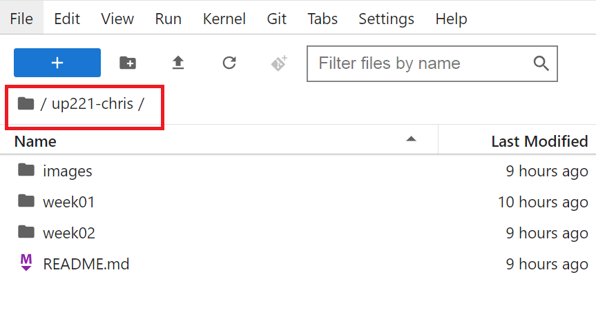

# Clone your repo

Go to your class repo page. The URL should look something like this: 

`https://github.com/your_name/up221`

Copy the clone URL:

<kbd></kbd>

Launch JupyterHub

Make sure you are at the root folder: 

<kbd></kbd>

You can change the directory using the cd command 

In the file menu bar, go to `Git`, `Clone a Repository`:

<kbd></kbd>

If this does not work, it is helpful to use the terminal to manually clone and push using terminal:

<kbd></kbd>

With terminal open, type in ```pwd``` to check your working directory. To nest to upwards, you type ```.../``` for each folder you want to get out of. [More information on changing directories](https://www.git-tower.com/learn/git/ebook/en/command-line/appendix/command-line-101). To change directories to your GitHub up221- repo, type ```cd``` and the name of your folder. First, we will ```git clone https://github.com/username/up221-yourname.git```. This will pull in your remote repository. You can add folders and ipython notebooks and push them to your GitHub throughout the Quarter.  

<kbd></kbd>

Enter (paste) the URL to your repo

You should now see your repo in the root directory:

<kbd></kbd>

From here onwards, this will be your workspace for individual assignments, code experiments, and general data science work related to the class.