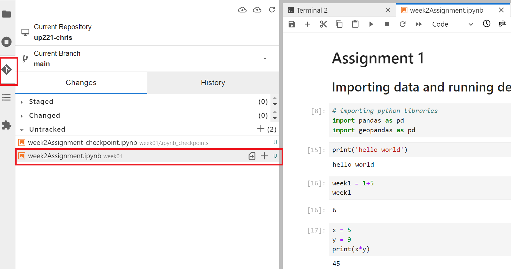

# Commit your changes to your GitHub class repo.

Make sure you are inside your `up221` folder, and then click on the Git tab on the left side of your JupyterLab panel.

Under the `Untracked` section, you should see all the files that you have modified. Click on the `+` button next to each file, and make sure that it moves to the `Staged` section.

<kbd></kbd>

If this does not work, open up terminal and change directory to your ```cd``` week02 folder. Type into the Terminal command line ```git add week2Assignment.ipynb``` or whatever you have named your assignment. This will `Stage` your notebook. 


Add a comment that summarizes your work (ex: Week 1 assignment) and click on the `COMMIT` button. You can type on the Terminal command line ```git commit -m 'assignment1' week2Assignment.ipynb``` to add a summary message

You should now see an orange light next to the icon that looks like a cloud with an up arrow. Click on it to push your changes to your repo.

<kbd></kbd>

You will need your GitHub username and your GitHub access token. NOTE: when you paste your access token, it will not appear. Just hit enter or return on your keyboard to upload your assignment. 

If this does not work, in Terminal type ```git push```. HINT: I prefer to do this on the Terminal command line. 

<kbd></kbd>

WARNING: If you manually upload or edit your markdown, images, data directly on your GitHub website. You will have to open Terminal before you start working on future assignments, switch to your repository, and run [```git pull```](https://git-scm.com/docs/git-pull). 