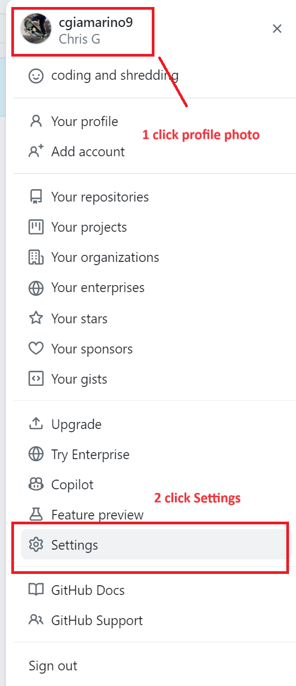
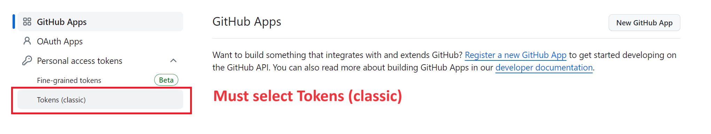
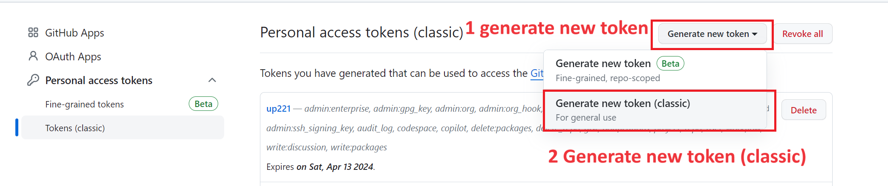
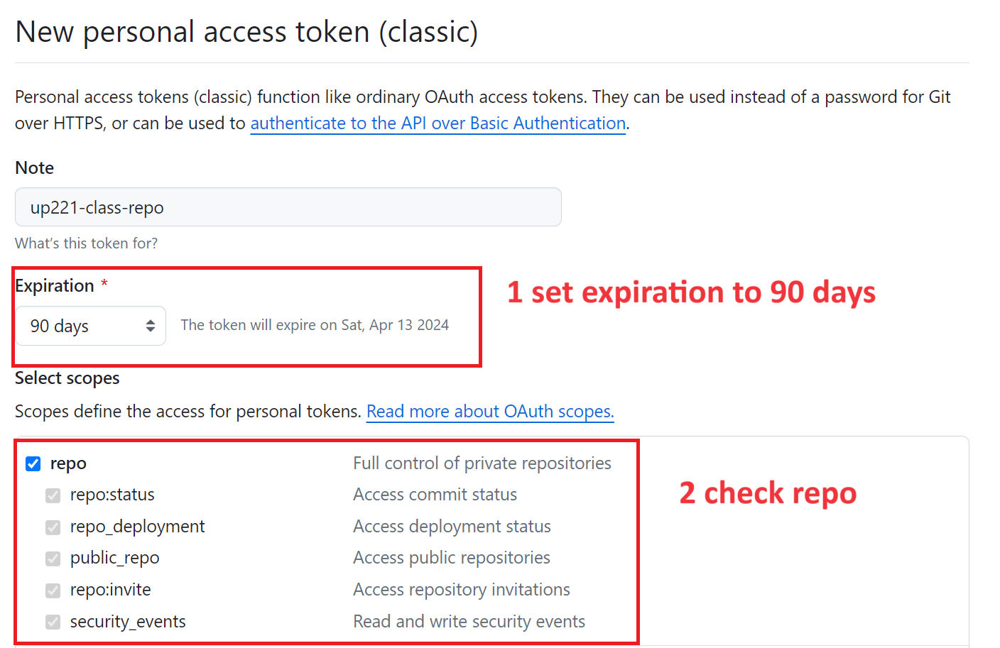
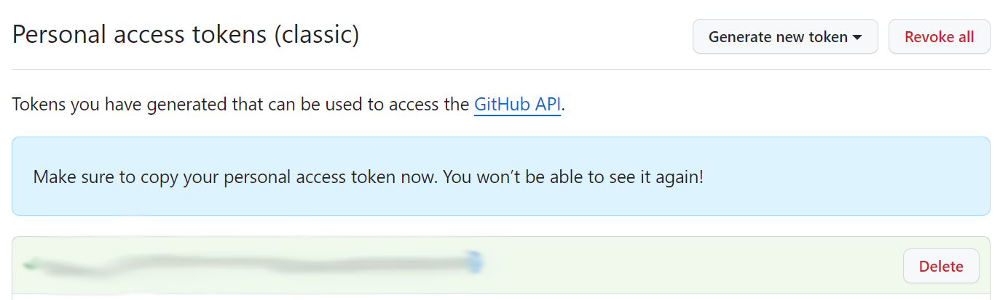

# Create a token

In order to pull and push content to GitHub, you must first create a token, which will serve as your password.

Go to your profile settings page.

<kbd></kbd>

Select `Developer Settings` from the left panel, and then `Personal access tokens`.

Click on the `Generate new token` button.

<kbd></kbd>
<kbd></kbd>

Set the expiration date to at least 90 days.

Check the box next to `repo`.

Scroll down and generate the token.

<kbd></kbd>

Copy and store your access token in a safe place. You will be using it throughout the course. WARNING: Once you close this page, your access token will disappear. Copy and paste it into your course document on your cloud service or local laptop. 

<kbd></kbd>

