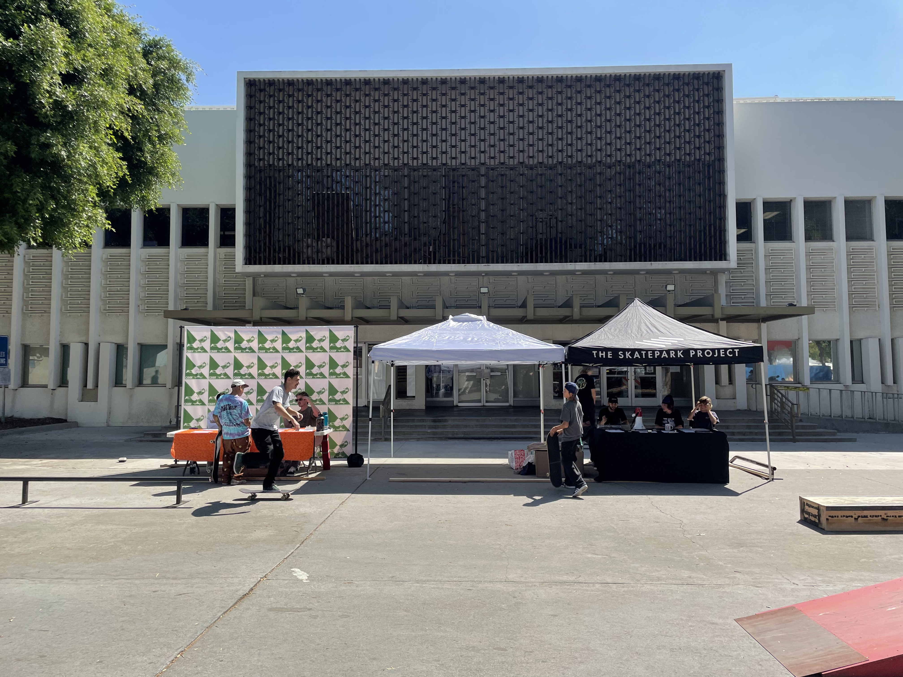

# Week 1

<xl>

UP221: Introduction to GIS and Spatial Data Science

</xl>

[Course zoom link for Winter Quarter 2024](https://ucla.zoom.us/j/94971812993?pwd=NjI4bkxRR2s3Q0FVblU0WmlHbXNodz09)

January 8, 2024

##
<xl>

*Note that this course will be recorded🎥

</xl>

# Hello!

## 

## Call me "Chris"

# Overview of the course
##

* Mark your [attendance ✅](https://docs.google.com/spreadsheets/d/15hvcbzJbfwa70KvKMWUG63oyRWaY_NEfx4pVJpi_f6w/edit?usp=sharing) 
* Fill out the [pre-class](https://docs.google.com/forms/d/e/1FAIpQLSfs2NtxTY5HTcT6fr3-5TqoiD0fVcWptpjRifR1NU6v5jdXRg/viewform?vc=0&c=0&w=1&flr=0&pli=1) poll if you haven't already ☑️
* Go over the [Syllabus](https://github.com/cgiamarino9/24W-UP221) 📜

## Meet your TA's
  * Ariella Ventura 
  * Lucy Briggs

## Logistics
* Two monitors encouraged
  * Laptop + external monitor
  * Laptop + iPad
  * Laptop + cell phone)
* Zoom setup: video **ON** by default PLEASE!
* Slack: **ALL** coding questions must be posted on slack
* [the ultimate T.A.'s guide to success](https://docs.google.com/document/d/14fz3iSSb76PDiyqY8ZGDpao3umKMgvvR5NtvQwOsJao/edit)
* Waitlist student considerations
  * Next week we will create our groups! If you must drop the course, please do so before the next class... There is also a long wait list!

## Class spirit

<xl>

Collaboration

</xl>

## Questions?

# Lab session 🗺

## Set your environment
First, grab the course material, and "pull" it into your JupyterHub space:

* [UP221 Git Puller](https://jupyter.idre.ucla.edu/hub/user-redirect/git-pull?repo=https%3A%2F%2Fgithub.com%2Fcgiamarino9%2F24W-UP221&urlpath=lab%2Ftree%2F24W-UP221%2F&branch=main) (This link will automatically launch JupyterHub and clone the course material into your directory)

##

Today's lab will cover the following topics:

*   Introducing GitHub
*   Introducing JupyterHub
*   Intro to Python

# Individual Assignments

There are three deliverables this week. Each are due on Sunday by midnight. Each assignment must be posted in the [class discussion section](https://github.com/cgiamarino9/24W-UP221/discussions).

## #1. Create a GitHub account, and start a new repo

*   Create a GitHub account, and create a project repo named “up221-yourfirstname” - [Instructions](https://github.com/cgiamarino9/24W-UP221/blob/main/Git%20related/02%20-%20Create%20your%20class%20repo.md)
*   Create a Readme.md file in your GitHub class repo, and introduce your Data Science project space (hint: use this [markdown guide](https://guides.github.com/features/mastering-markdown/))
*  Submit your assignment [here](https://github.com/cgiamarino9/24W-UP221/discussions/2)

## #2. Submit two or more datasets
Search for two or more potential data sources that you may use for your research. If you are you using a web resource, make sure that they are "downloadable." Upload your datasets to your repo. First, create a folder titled "data," and upload your datasets in there.

### Acceptable formats:
- csv
- excel
- google sheet (provide link)
- geojson
- shapefile
- API source

### Submit your dataset assigment [here](https://github.com/cgiamarino9/24W-UP221/discussions/3), and make sure to provide the following information for each of your two datasets:

1. Name of the data
1. Description of the data and how you may use it for your project
1. A URL link to the source (if you got it from a website), or a description of where you got your data from
1. A URL link to the data on your repo

## #3. Thinking cap 🤔
This week's "thinking cap" assignment is for you to find an article, blog, journal, chapter, or book that includes a spatial component (a map, chart, graphic) in regards to a topic related to urban justice. Make sure it is something that you would like to share with the class. 

###
Then, write post with two parts:

- A paragraph that summarizes the article and reflects critically and creatively about the material in your own words. Why did this article speak to you in regards to your approach to data and research? How does it inform your learning goals for this course? 
- How do you think the graphical outputs (maps/charts) were created for the article? Where did the data come from, and how do you think the outputs were created? Does it *work*? Why or why not?

The instructors will select a few of the readings for discussion in week 2.

Submit your assignment [here](https://github.com/cgiamarino9/24W-UP221/discussions/1).
