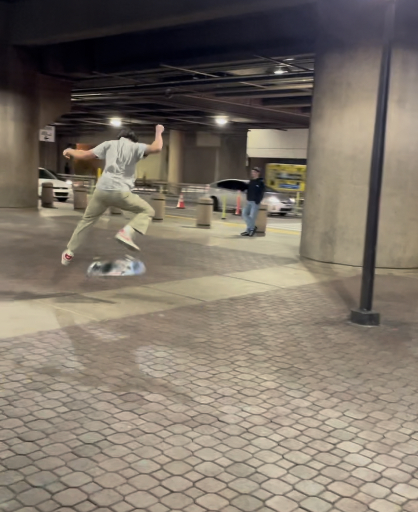
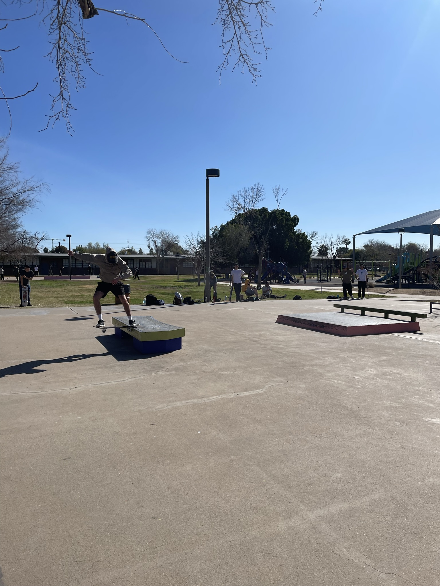
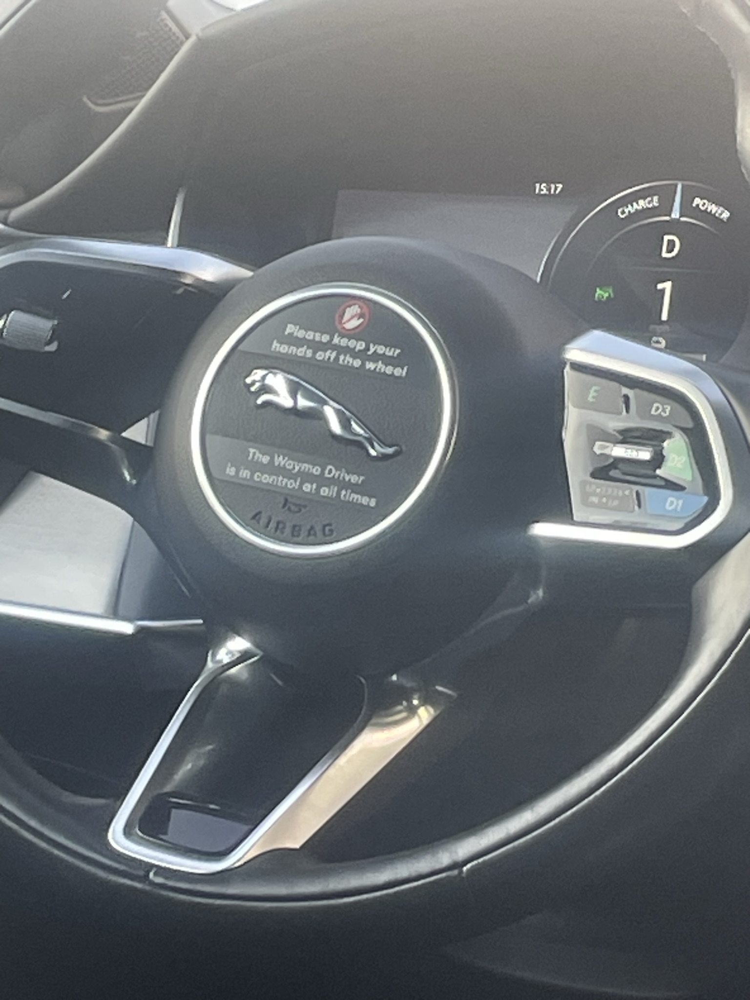
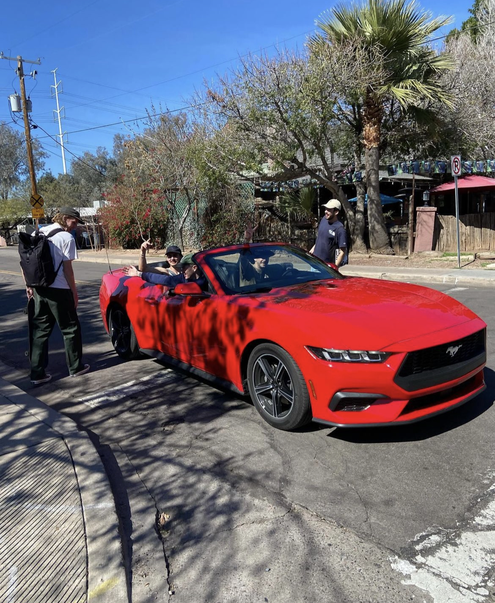
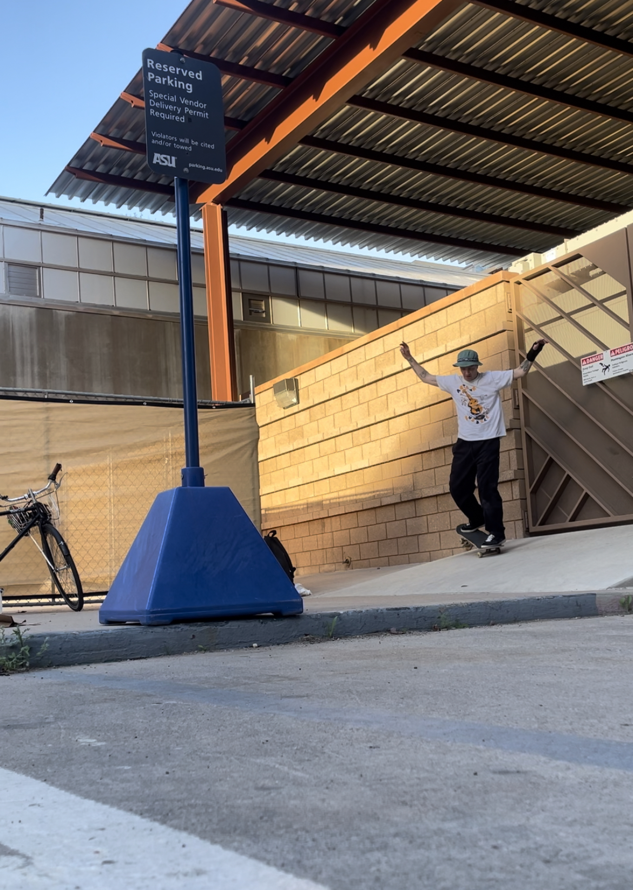
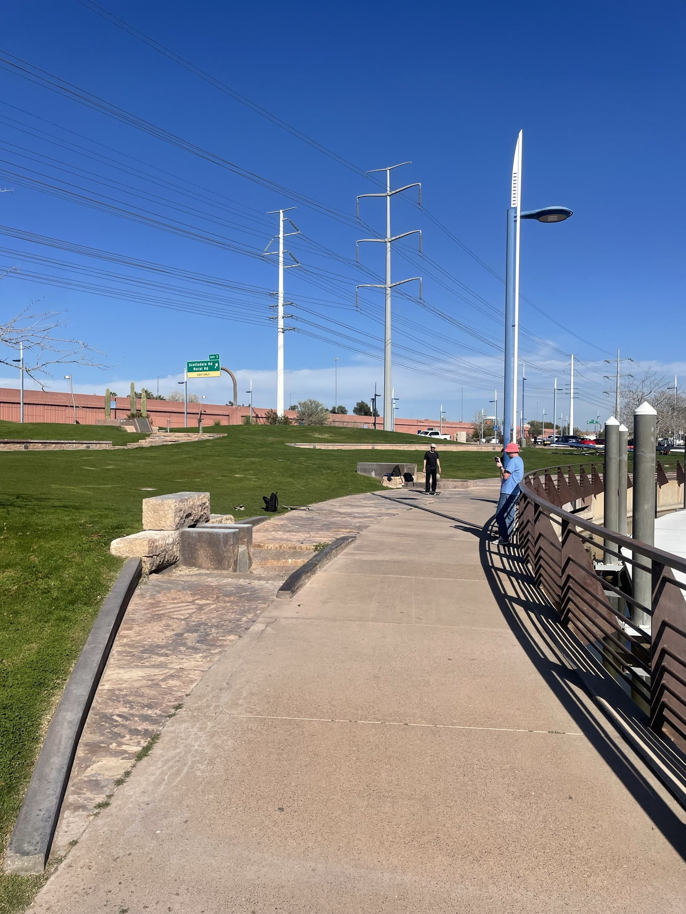
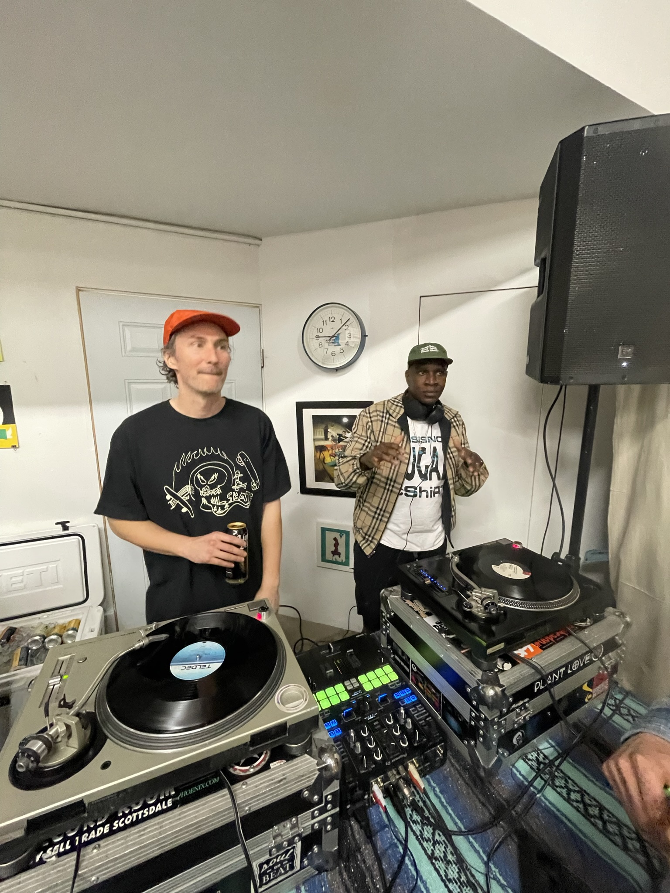
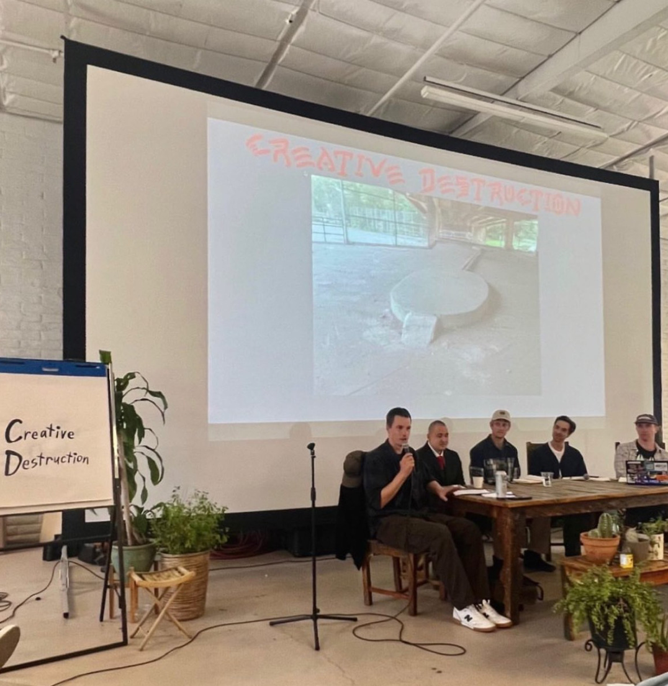
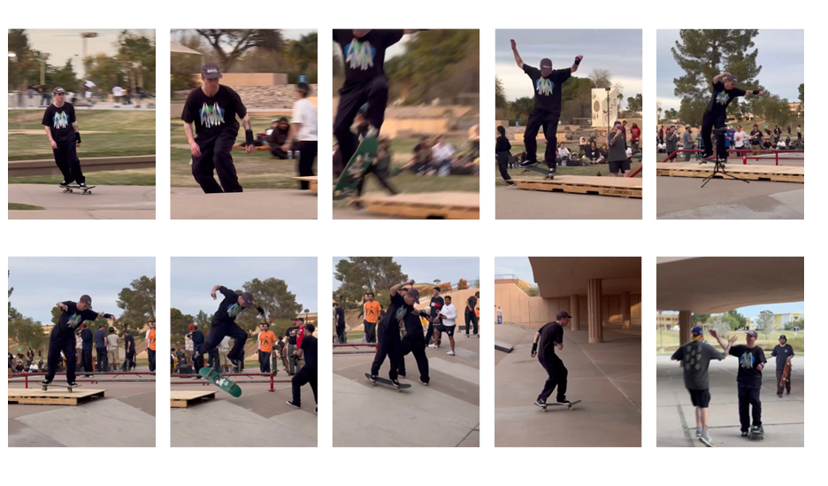
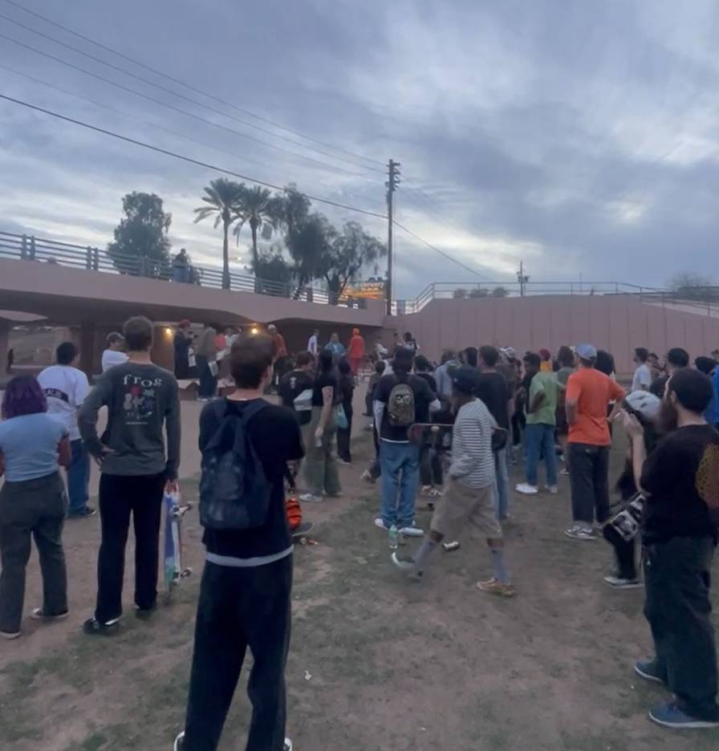

# Week 7

<xl>

Isochrone Maps

</xl>

[Course Zoom](https://ucla.zoom.us/j/94971812993?pwd=NjI4bkxRR2s3Q0FVblU0WmlHbXNodz09)

February 20, 2024

## Let's pull

First, grab the course material, and "pull" it into your JupyterHub:

* [UP221 Git Puller](https://jupyter.idre.ucla.edu/hub/user-redirect/git-pull?repo=https%3A%2F%2Fgithub.com%2Fcgiamarino9%2F24W-UP221&urlpath=lab%2Ftree%2F24W-UP221%2F&branch=main) 
(This link will automatically launch JupyterHub and clone the course material into your directory). 

<small>Note that you have to do this at the start of every lecture to get the latest material.
</small>

##
<xl>

*Note that this course will be recorded🎥

</xl>

##

<xl>
My weekend at Slow Impact 2
</xl>
 
A little taste of a skateboarding retreat, festival, and conference in Arizona

##

##

##

##

##

##

##

##

##

##

# Hands on Lab

## Lab: Part 1
<xl>
    Isochrone Maps
</xl>
 
- Break

## Data Challenge
<xl>
    Group coding time!
</xl>

# Assignments

<xl>

Group Assignment #3

</xl>

[Instructions](https://github.com/cgiamarino9/24W-UP221/blob/main/Group%20Assignments/GroupAssignment3.md)

Submit your assignment [here](https://github.com/cgiamarino9/24W-UP221/discussions/10)