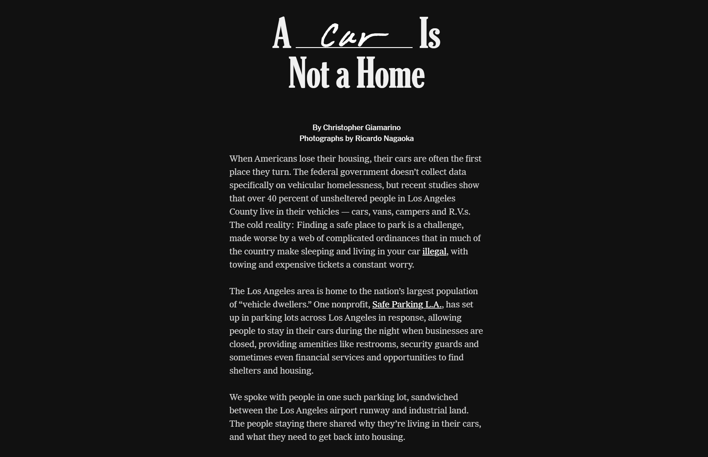
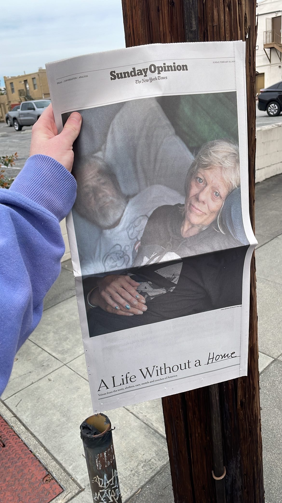
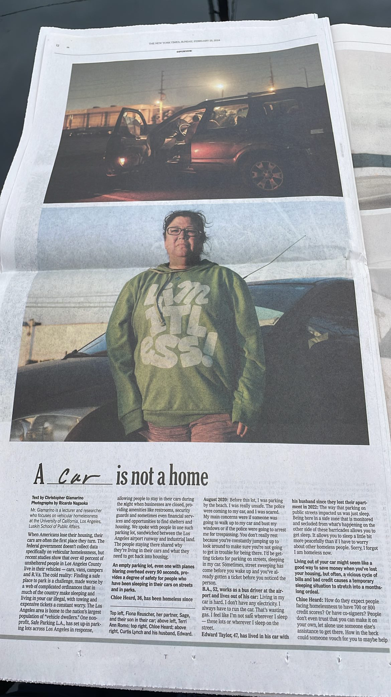
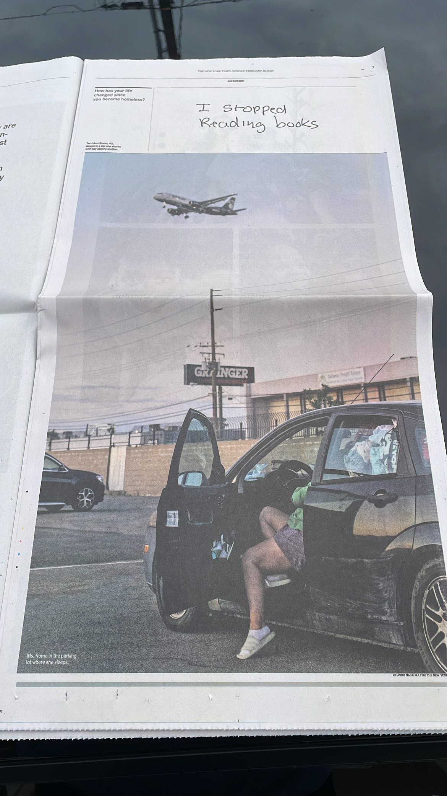
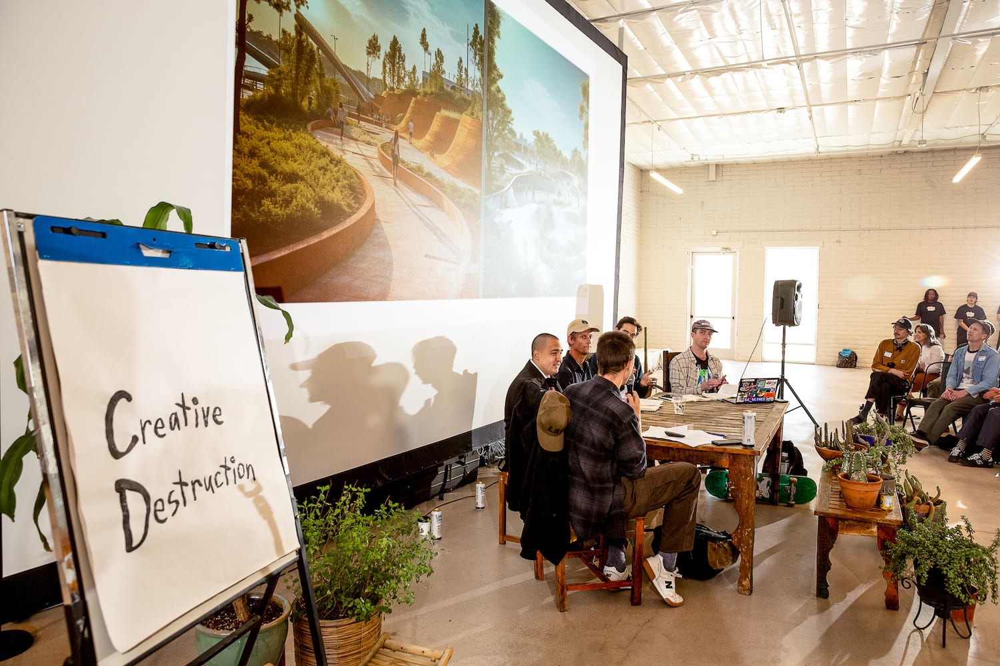

# Week 8

<xl>

Spatial Autocorrelation

</xl>

[Course Zoom](https://ucla.zoom.us/j/94971812993?pwd=NjI4bkxRR2s3Q0FVblU0WmlHbXNodz09)

February 26, 2024

## Let's pull

First, grab the course material, and "pull" it into your JupyterHub:

* [UP221 Git Puller](https://jupyter.idre.ucla.edu/hub/user-redirect/git-pull?repo=https%3A%2F%2Fgithub.com%2Fcgiamarino9%2F24W-UP221&urlpath=lab%2Ftree%2F24W-UP221%2F&branch=main) 
(This link will automatically launch JupyterHub and clone the course material into your directory). 

<small>Note that you have to do this at the start of every lecture to get the latest material.
</small>

##
<xl>

*Note that this course will be recorded🎥

</xl>

##
<xl>

[A car is not a home](https://www.nytimes.com/interactive/2024/02/21/opinion/homelessness-crisis-america-stories.html?unlocked_article_code=1.XE0.NdbI.OxRCaxV6K_2j&smid=url-share) 

</xl>
 
<em>New York Times</em> publication 

##

##

##

##

##
   

##
<xl>

[Thrasher Magazine recap of Slow Impact 2](https://www.thrashermagazine.com/articles/slow-impact-photo-recap/) 

##

</xl>

## Today's Agenda

Lab: 
<xl>Spatial Autocorrelation 
</xl>

</xl>

## Group Assignment

<left>
There are NO deliverables for the groups this week. But PROMISE that you will meet with your partners, and make progress on any of the materials gearing up for the final project. You will be asked to sumbit a draft of your final project materials by Week 10. You may choose to:
</left>

<small>

- Clean up/update your project proposal
- Clean up/update your Jupyter Notebooks and data visuaulization outputs
- Create new notebooks with additional content that adds to your project
- Plan for the final project presentation
- Meet with your instructors to dicuss your project
- Post on the slack channel!
- [Extra credit group assignment](https://github.com/cgiamarino9/24W-UP221/blob/main/Group%20Assignments/GroupAssignment4.md). Will count toward missing one missing assignment from quarter.